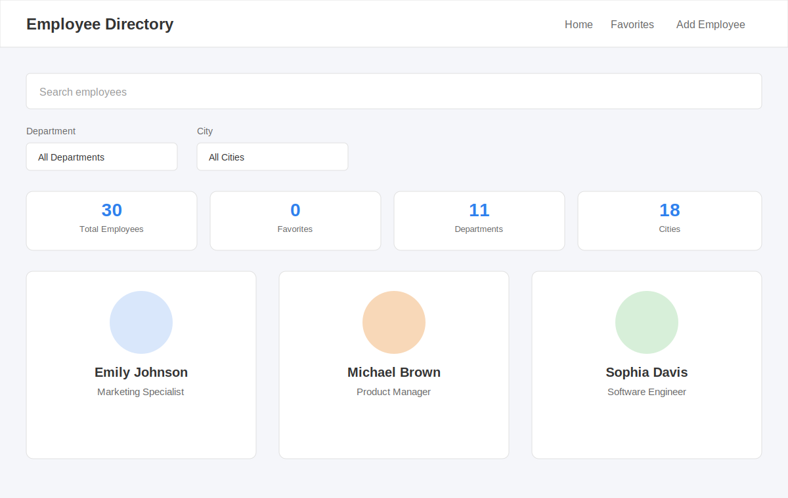
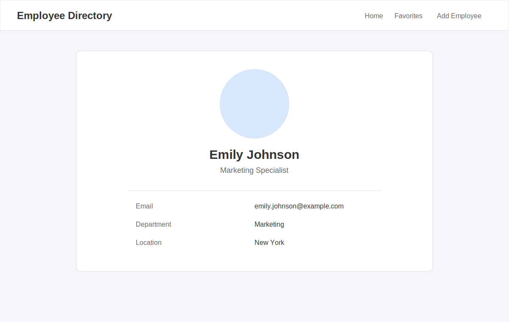

# Employee Directory

A React application that displays employees fetched from https://dummyjson.com/users, with search, filters, sorting, favorites, pagination, and local add/edit/delete support.

## Live Demo

[View Employee Directory](https://employee-directory-puce-five.vercel.app)

## Screenshots




## Technology Stack

- React 18 (functional components, hooks)
- React Router v6 (routing, including lazy-loaded routes)
- Vite (build tool and dev server)
- Plain CSS with CSS variables for light/dark theming
- Vitest + React Testing Library (automated tests)
- Browser localStorage (favorites, added/edited/deleted employees, theme, view preference)

## Node.js Requirement

Node.js version 18 or higher is required.

## Setup

1. Install dependencies:
   ```
   npm install
   ```
2. Run the app:
   ```
   npm run dev
   ```
3. Open the URL shown in the terminal (usually http://localhost:5173)

## Testing

Run the automated test suite with:
```
npm test
```
Or in watch mode while developing:
```
npm run test:watch
```
Tests cover: search filtering, department/city filtering, sorting, statistics calculation, form validation, favorite toggling, employee card rendering, pagination behavior, and error/retry handling.

## Production Build

```
npm run build
npm run preview
```

## Project Folder Structure

```
src/
├── components/
│   ├── Header.jsx
│   ├── SearchBar.jsx
│   ├── EmployeeCard.jsx
│   ├── EmployeeList.jsx
│   ├── EmployeeFilters.jsx
│   ├── EmployeeForm.jsx
│   ├── Statistics.jsx
│   ├── Pagination.jsx
│   ├── ConfirmationModal.jsx
│   ├── Loader.jsx
│   └── ErrorMessage.jsx
│
├── pages/
│   ├── Home.jsx
│   ├── EmployeeDetails.jsx
│   ├── Favorites.jsx
│   ├── AddEmployee.jsx
│   └── EditEmployee.jsx
│
├── hooks/
│   ├── useEmployees.js
│   ├── useFavorites.js
│   ├── useLocalStorage.js
│   ├── useTheme.js
│   └── useDebounce.js
│
├── services/
│   └── api.js
│
├── utils/
│   ├── csvExport.js
│   ├── validation.js
│   └── employeeHelpers.js
│
├── test/
│   └── ... automated tests
│
├── App.jsx
└── main.jsx
```

## Features

- Fetches employee data with fetch + useEffect, using AbortController to cancel in-flight requests on unmount or when a new request starts
- Debounced search (400ms) by first name, last name, and email
- Department and city filter dropdowns, combinable with search and sorting
- A-Z / Z-A sorting
- Grid and list view, saved to localStorage
- Favorite employees, saved to localStorage, with a dedicated Favorites page
- Add, edit, and delete employees locally (saved in localStorage; the API itself is never modified)
- Accessible confirmation modal for deletions (focus trap, Escape to close, click-outside to close, focus restoration)
- Statistics dashboard (total employees, favorites, departments, cities, average age)
- Pagination with Previous/Next, page numbers, and adjustable page size (5/10/20)
- CSV export of the currently filtered employee list
- Dark/light theme toggle, saved to localStorage
- Loading spinner and a friendly error message with a Retry button
- Route-level code splitting with React.lazy and Suspense
- Responsive layout (mobile, tablet, desktop)

## Known Limitations

- Locally added/edited/deleted employees are stored in the browser's localStorage only; they are not persisted to a backend and will not sync across devices or browsers.
- The dummyjson.com API only returns 208 employees; locally added employees are appended to that list for this session/browser only.
- No authentication or authorization is implemented, since this is a front-end learning project.

## Accessibility Notes

- The search input has an associated label (visually hidden) and an `aria-label`.
- Favorite buttons include an `aria-label` that names the employee and the action being performed.
- The confirmation modal uses `role="dialog"`, `aria-modal`, traps focus while open, closes on Escape or outside click, and restores focus to the triggering element on close.
- Form fields use `aria-invalid` and `aria-describedby` to associate validation errors with their inputs.
- Employee images use `loading="lazy"` with explicit width/height to reduce layout shift.
